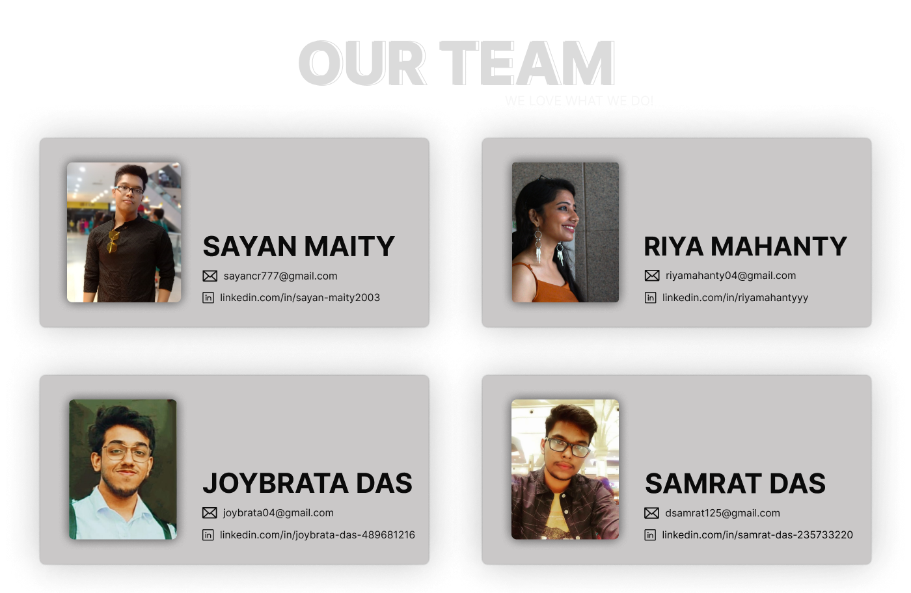

  

    
  

  <h1 align="center"> Dermify.AI </h1>

<h3 align="center">
  🏆 Winner of the "Best AI Hack" @Diversion Hackathon 2024 by IEM-ACM
</h3>

##  Project Details :

  

> Welcome to the `Dermify.AI` 👨🏻‍⚕️💉 web app! Dermify is the first AI powered Skin Diagnosis application which harnesses the power of Image Processing and Google's Bard (LLM) to offer cost-effective and accessible skin condition assessments worldwide.

Author : [Sayan Maity](https://github.com/Sayan-Maity) | [Riya Mahanty](https://github.com/riyamahantyyy) | [Joybrata Das](https://github.com/joyous4) | [Samrat Das](https://github.com/das2Samrat)

## 🛠️ Built with :

           

- **Frontend**: ReactJS, Chakra-UI
- **Backend**: NodeJS, ExpressJS, MongoDB
- **Model**: Google Bard (LLM), Huggingface Model
- **API**: Magic-sdk api, Razorpay api, Formspree api
- **Version Control**: Git
- **Hosting**: Render, Vercel

## ✨ Features :

- Comprehensive overview of users’ health and wellness, facilitating easy tracking and management of health data
- Advanced image analysis through (AI model and google's Bard LLM) for instant identification and diagnosis of skin conditions, providing immediate insights into dermatological health
- Personalized skincare recommendations and routines based on individual skin types and concerns, promoting healthier and more radiant skin
- Access to a vast medical information database, enabling quick and accurate searches for comprehensive disease-related details
- Data-driven insights for monitoring and optimizing overall health, offering valuable information for informed lifestyle choices
- Used Magic-sdk for fast and most secure passwordless authentication
- Receive personalized alerts based on health analytics, providing timely information for informed lifestyle choices
- Supportive online community for sharing experiences, seeking advice, and connecting with others facing similar health challenges
- Explore options to upgrade plans (premium users) for enhanced features and benefits
- Connect with healthcare professionals for online consultations (Video Chat) and advice

## 📸 Screenshots :

## 📸 Developers :

    
  

## 📝 Endnote :

While doing this project I (Sayan), Riya, Samrat and Joybrata have learnt how to work in a team and time bounded situation. We enjoyed every moment doing this project and taking part in this awesome hackathon. We are also thankful to all the organizers for organizing this hackathon.
